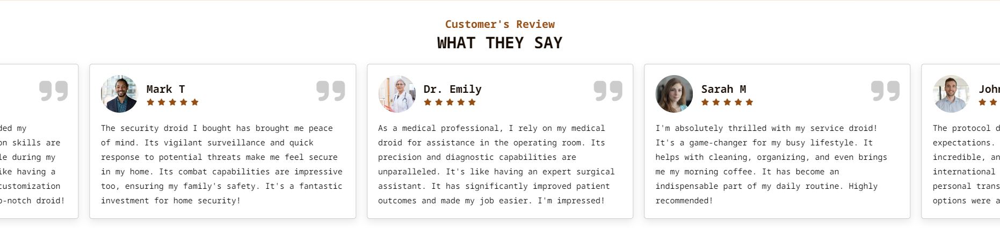
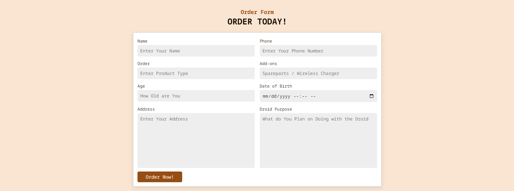
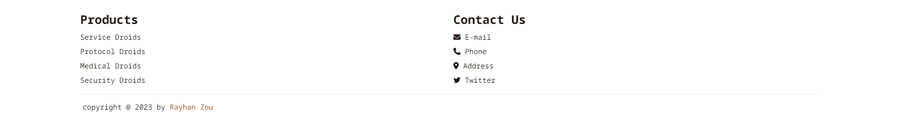
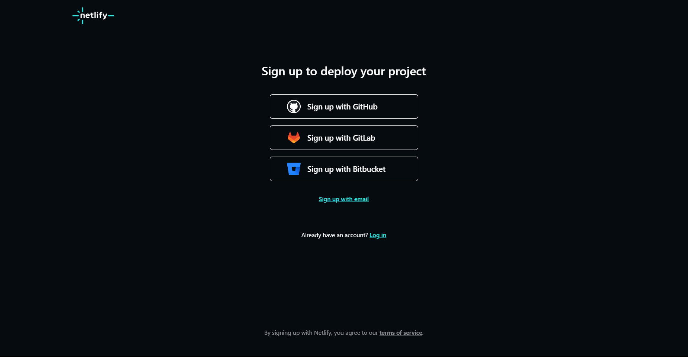
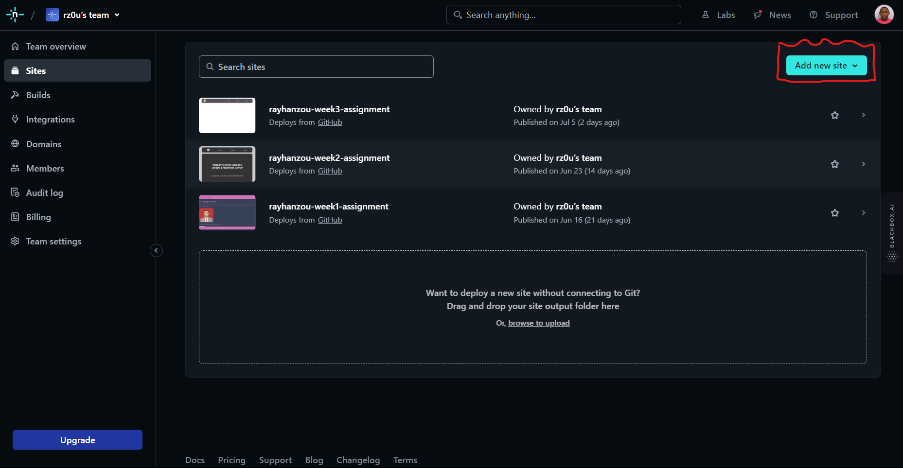
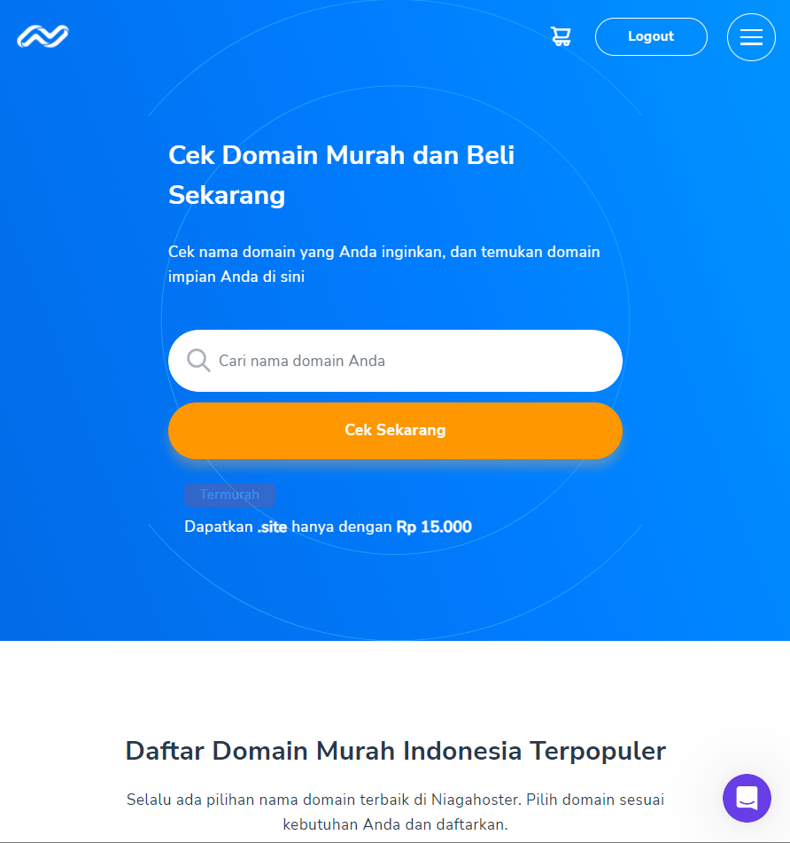
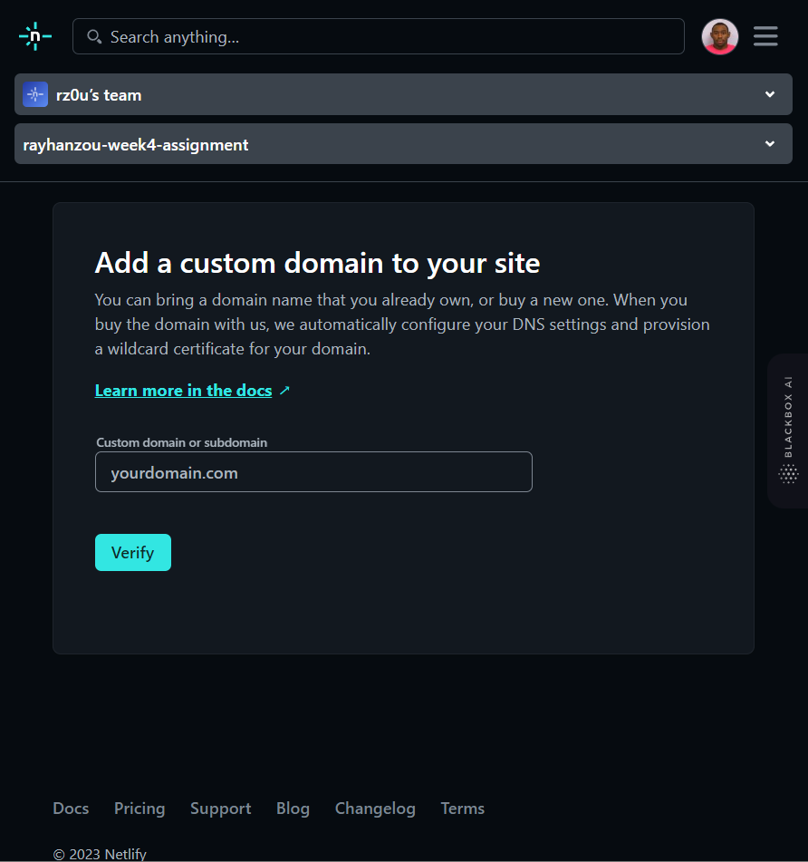
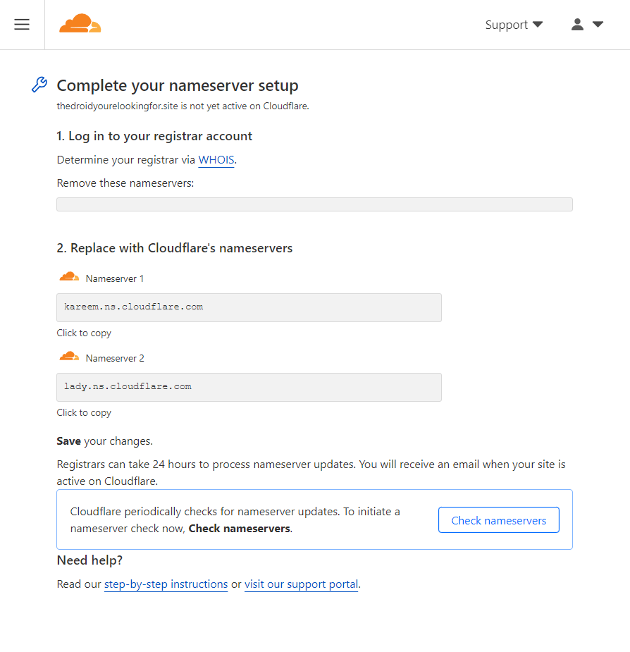
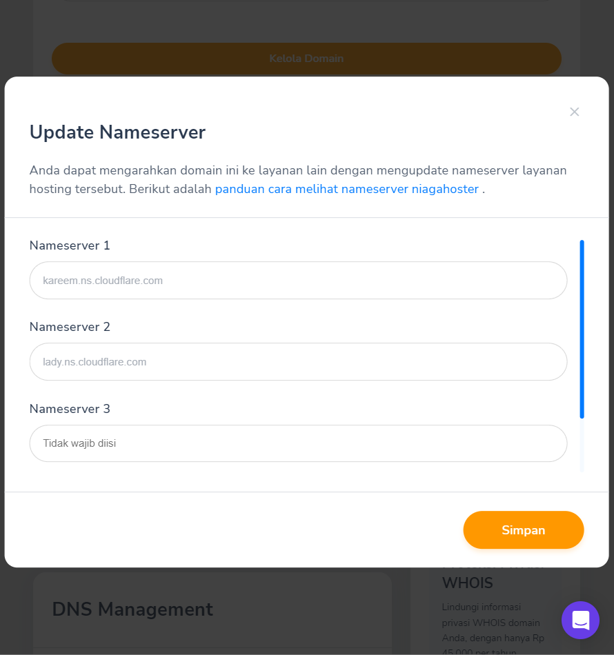
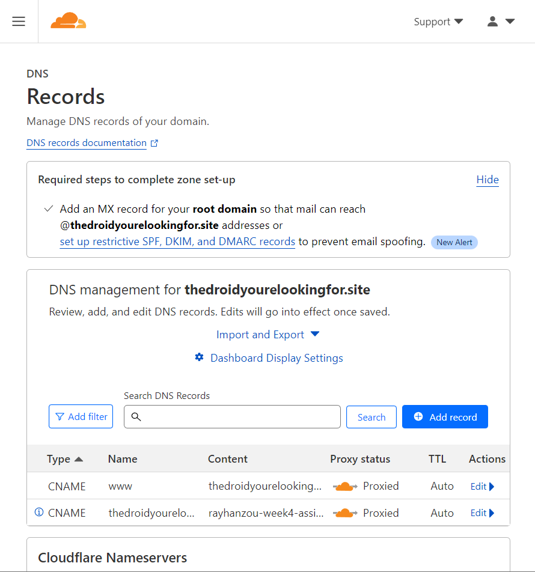

# Project Milestone 1
## Greetings Human !

I'm Rayhan Zou, shifting from the mining industry to the tech industry. Eager to learn and stay updated with the latest advancements, I bring a strong work ethic, problem-solving skills, and adaptability. With a passion for making a positive impact, I'm committed to continuous learning, embracing new challenges, and leveraging technology for innovative solutions. Excited about the opportunities for growth and shaping the future through tech.

Within this repository, I have created an engaging and contemporary website for a company specializing in droid sales. This project builds upon the work I have previously done.

## Table Of Contents
- [Project Milestone 1](#project-milestone-1)
  - [Greetings Human !](#greetings-human-)
  - [Table Of Contents](#table-of-contents)
  - [Website Building](#website-building)
    - [Navigation Bar and Auto Scrolling JS](#navigation-bar-and-auto-scrolling-js)
      - [Navbar](#navbar)
      - [SwiperJS](#swiperjs)
    - [About and Product Card](#about-and-product-card)
      - [About and Taglines](#about-and-taglines)
      - [Product Card and Transition](#product-card-and-transition)
    - [Reviews, Order Form, and Footer](#reviews-order-form-and-footer)
      - [Reviews](#reviews)
      - [Order Form](#order-form)
      - [Footer](#footer)
  - [Deploying the Website](#deploying-the-website)
    - [Sign up for Netlify](#sign-up-for-netlify)
    - [Create a New Site](#create-a-new-site)
    - [Buy a Domain from NiagaHoster](#buy-a-domain-from-niagahoster)
    - [Configure Custom Domain](#configure-custom-domain)
    - [Sign up for Cloudflare and Add Your Domain](#sign-up-for-cloudflare-and-add-your-domain)
    - [Update Nameservers in Niagahoster](#update-nameservers-in-niagahoster)
    - [Set Up Cloudflare DNS Settings](#set-up-cloudflare-dns-settings)
    - [Wait for DNS Propagation](#wait-for-dns-propagation)
  - [You Can Visit the Finished Product Here](#you-can-visit-the-finished-product-here)

## Website Building
This is a documentation on how i built my website from the ground up, the first step i did was adding a HTML boilerplate to my index.html file and from there i start making the HTML barebone such as navbar, header, main, section, and footer.

after that i start filling those tags with the content that i already have in mind, starting from the navbar

### Navigation Bar and Auto Scrolling JS
#### Navbar
```
  <nav>
    <div class="logo">
      <a href="#">Logo</a>
    </div>
    <ul class="nav-links">
      <li><a href="#">Home</a></li>
      <li><a href="#">About</a></li>
      <li><a href="#">Services</a></li>
      <li><a href="#">Contact</a></li>
    </ul>
  </nav>
```
Start by creating the basic HTML structure for your navigation bar. then try to style it with css complete with the hamburger menu while its active. the next part is trying to add the js for the hamburger button
```
var burger = document.querySelector('.burger');
var navLinks = document.querySelector('.nav-links');

burger.addEventListener('click', function() {
  navLinks.classList.toggle('active');
});
```
this is how it looks with the styling already done


#### SwiperJS
The second part is where we'll try to make the header section, with the help of autoplay feature from SwiperJS, first of all we need to make the HTML code for it first.
```
<section class="home" id="home">
      <div class="swiper home-slider">
        <div class="swiper-wrapper wrapper">
          <div class="swiper-slide slide">
            <div class="content">
              <span></span>
              <h3></h3>
              <p></p>
            </div>
            <div class="image">
              
            </div>
          </div>
        </div>
        <div class="swiper-pagination"></div>
      </div>
    </section>
```
after we made the HTML and the content we start working on the styling with CSS, after that we try to insert the SwiperJS by linking the NPM package to the script tag
```
<script src="https://cdn.jsdelivr.net/npm/swiper@8/swiper-bundle.min.js"></script>
```
after doing that we need to pick which feature we want to use and insert it into the html tag, also do not forget to copy and paste the script into our JS file. you can tweak some of the feature there such as delay time and looping. for the complete tutorial you can check this link [SwiperJS tutorial](https://www.youtube.com/watch?v=E7mGqt7v3Uc&pp=ygUNc3dpcGVyanMgZGVtbw%3D%3D)

this is how it looks with the navigation bar and header all set


### About and Product Card
#### About and Taglines
First of all before we even start to code, we need to prepare the content that we're about to write, we can achieve this by searching online for inspiration like taking a model from a named company.

After preparing the content we can go ahead and start coding starting from writing the HTML in the correct semantics so our lighthouse score can go up.
```
<section class="about" id="about">
      <h3 class="sub-heading"></h3>
      <h1 class="heading"></h1>

      <div class="row">
        <div class="image">
          <!--  -->
        </div>
        <div class="content">
          <h3></h3>
          <p></p>
          <div class="icons-container">
            <div class="about-box">
              <div class="icons">
                <i class="fa-solid fa-brain"></i>
                <span></span>
              </div>
              <p></p>
            </div>
          </div>
      </div>
    </section>
```
dont forget to also write the css code to make it looks beautiful and aesthetically pleasing, this is how my web looks like after applying some line of css into it. also for this section we dont need any JS.


#### Product Card and Transition
The Second Part is building the code for the product card so it looks clean and cool on our web, starting from writing the code and finishing up with some zesty css styling
```
<section class="product" id="product">
      <h3 class="sub-heading"></h3>
      <h1 class="heading"></h1>

      <div class="box-container">
        <div class="product-card">
          
          <figcaption class="product-card-caption">
            <div class="product-card-header">
              <h2 class="product-card-title"></h2>
              <p class="product-card-subtitle"></p>
            </div>
            <div class="product-card-footer">
              <span class="product-card-price"></span>
              <button name="buy" class="product-card-button">
                <i class="fa-solid fa-plus"></i>
              </button>
            </div>
          </figcaption>
        </div>
      </div>
    </section>
```
this is a peek of the finished product card, also note that i insert some transition for the button to make the website feel more alive


### Reviews, Order Form, and Footer
#### Reviews
This first part is almost identical to the time we made the header section, we use the SwiperJS again for the second time. The only differences is the content inside the autoplay carousel, this time the content is about the customer reviews about the product that they bought. as always we try to write the HTML followed with the css
```
<section class="review" id="review">
      <h3 class="sub-heading"></h3>
      <h1 class="heading"></h1>

      <div class="swiper-container review-slider">
        <div class="swiper-wrapper">
          <div class="swiper-slide slide">
            <i class="fas fa-quote-right"></i>
            <div class="user">
              
              <div class="user-info">
                <h3></h3>
                <div class="stars">
                  <i class="fas fa-star"></i>
                </div>
              </div>
            </div>
            <p></p>
          </div>
        </div>
      </div>
    </section>
```
as you can see the class of each div is more or less the same as the one at the header section, but this time we do not have to write any javascript as we already wrote it earlier and can use the same code simultaneously. this is how it looks after touching it up


#### Order Form
To create an order form in HTML, first set up the HTML structure with form tags. then add form elements such as input, select, and label for capturing user input. Configure the action attribute in the form tag to specify where the form data will be submitted. dont forget to style it with css
```
<form action="process-order.php" method="post">
    <label for="name">Name:</label>
    <input type="text" id="name" name="name" required>

    <label for="email">Email:</label>
    <input type="email" id="email" name="email" required>

    <label for="product">Product:</label>
    <select id="product" name="product">
      <option value="product1"></option>
      <option value="product2"></option>
    </select>

    <label for="quantity">Quantity:</label>
    <input type="number" id="quantity" name="quantity" required>

    <input type="submit" value="Place Order">
  </form>
```
this is how my form looks after i styled it with css and adjusting the border, padding, margin, and other properties


#### Footer
To create a footer in HTML set up the HTML structure with a footer tag.
Style the footer using CSS to define its background color, text color, and padding.
Customize the footer content, such as copyright information or additional details.
Test the footer in a web browser and make any necessary adjustments to the CSS or content.
```
  <footer>
    <p>&copy; 2023 Your Website. All rights reserved.</p>
  </footer>
```
this is how my footer looks after inserting it with useful information and other stuff



## Deploying the Website
After we're finished designing and writing the code for our website now is our time to put the result of our work on the internet. in this part i will guide you through the process of deploying the website starting from scratch up until we can access it through all platform

### Sign up for Netlify


1. Visit the [Netlify](www.netlify.com) website
2. Click on "Sign Up"
3. Choose a Sign-up Method
- If signing up with a third-party account:
   - Click on the corresponding button (e.g., "Continue with GitHub").
   - You'll be redirected to the authentication page of the selected platform.
   - Log in to your account and authorize Netlify to access your account information.
- If signing up with an email and password:
   - Fill in the required fields, including your full name, email address, and a secure password.
   - Optionally, you may see additional fields, such as a team name or a referral code.
   - Review and agree to the Netlify terms of service and privacy policy.
4. Complete the Sign-up Process
- If signing up with a third-party account:
   - Netlify will create an account for you using your existing third-party account credentials.
   - You may need to authorize Netlify to access certain account information or repositories.
- If signing up with an email and password:
   - Netlify will send you a verification email to the email address you provided during sign-up.
   - Open your email inbox and locate the email from Netlify.
   - Click on the verification link within the email to confirm your account.
5. Set Up Your Netlify Account
6. Explore Netlify Features

### Create a New Site


1. After signing in to Netlify, click on the "New site from Git" button on the Netlify dashboard.
2. Choose your preferred Git platform (GitHub, GitLab, or Bitbucket) or select "Continuous Deployment" if you prefer another Git provider or a local repository.
3. Authenticate and authorize Netlify to access your Git repository.
4. Select the repository that contains the website you want to deploy.
5. Configure the basic settings for your site, such as the branch to deploy, build command, and publish directory.
6. Click on the "Deploy site" button to initiate the deployment process.

### Buy a Domain from NiagaHoster


1. Visit the [Niagahoster](https://www.niagahoster.co.id/) website.
2. Use the domain search feature on the Niagahoster homepage to check the availability of your desired domain name.
3. Once you find an available domain, select it and proceed to the domain registration page.
4. Follow the steps to complete the domain registration process, providing the necessary details such as your personal information and contact details.
5. During the checkout process, select the desired domain registration period and any additional services you may need.
6. Proceed to make the payment to finalize the domain purchase.

### Configure Custom Domain


1. Once your site is deployed, navigate to the Netlify dashboard.
2. Select your site from the list of deployed sites.
3. In the site settings, click on "Domain settings" or "Settings" followed by "Domain management."
4. Click on "Add custom domain" to configure a custom domain for your website.
5. Enter the desired domain name you want to use (e.g., `www.example.com`) and click on "Verify."
6. Netlify will provide you with DNS configuration instructions. Keep this information handy as you'll need it in the next step.

### Sign up for Cloudflare and Add Your Domain


1. Visit the [Cloudflare](https://www.cloudflare.com/) website.
2. Click on the "Sign Up" button to create a Cloudflare account.
3. Follow the prompts to add your website/domain to Cloudflare.
4. Cloudflare will scan your DNS records. Ensure that the records match the ones provided by Netlify in Step 3.
5. Once the scan is complete, Cloudflare will provide you with new nameservers for your domain.

### Update Nameservers in Niagahoster


1. Log in to your Niagahoster account.
2. Locate the domain management section and access the nameserver settings.
3. Replace the existing nameservers with the new nameservers provided by Cloudflare.
4. Save the changes. This update may take some time to propagate across the internet.

### Set Up Cloudflare DNS Settings


1. Go back to the Cloudflare dashboard.
2. In Cloudflare, select your website/domain from the list of added sites.
3. Navigate to the DNS settings.
4. Verify that the DNS records match the ones provided by Netlify in Step 3.
5. If any records are missing, add them accordingly.
6. Save the DNS settings.

### Wait for DNS Propagation
After updating the DNS settings, it may take some time for the changes to propagate across the internet. DNS propagation can vary and may take up to 24-48 hours, although it often happens much faster.

## You Can Visit the Finished Product Here
- [**https://thedroidyourelookingfor.site**](https://thedroidyourelookingfor.site)
- [**www.thedroidyourelookingfor.site**](https://www.thedroidyourelookingfor.site)
- [**https://rayhanzou-week5-assignment.netlify.app**](https://rayhanzou-week5-assignment.netlify.app)